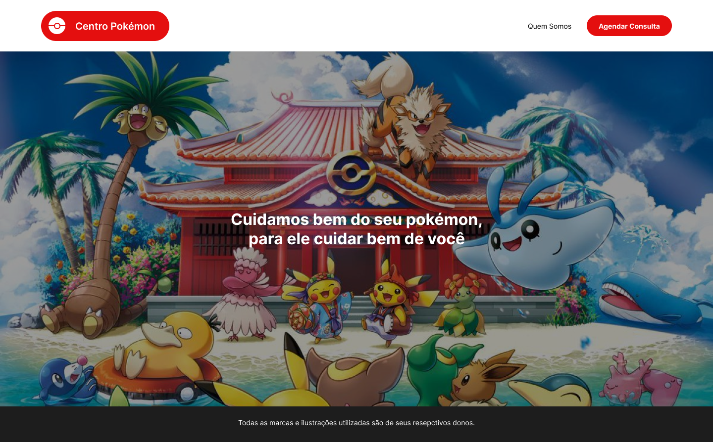

# Centro Pokémon

## Ferramentas utilizadas

- TypeScript
- Yup
- PNPM
- ReactJS
- Axios
- NextJS
- Toastify
- React-Hook-Form
- Styled-Components

Desafio para desenvolvimento frontend – React/Next.js. | codie.digital

## Setup

Instale as dependências do código com:

```shell
pnpm install

```

## Inicie o projeto

```shell
pnpm run dev

```

## Objetivo

Desenvolver uma aplicação web em Typescript com Next.js, que implemente o design predefinido.

### Requisitos

- ✅ Tratar possíveis erros de API
- ✅ Demonstrar conhecimento do uso de hooks
- ✅ Criar um código desacoplado, organizado e testável
- ✅ Demonstrar conhecimento de modularização de componentes
- ✅ Utilizar CSS in JS – styled components para estilizar as páginas
- ✅ Demonstrar conhecimento de TypeScript e suas features para organizar o projeto
- ✅ Obrigatório o uso do react-hook-form + yup para o desenvolvimento do formulário
- ✅ Deve ser usado Page Router do Next.js e não a nova versão >=14.0.0 no desenvolvimento deste projeto.
- ✅ Demonstrar organização, desacoplamento e separação de responsabilidades no código; obrigatório o uso de inversify + clean architecture

### Diferencial

- ✅ Demonstrar conhecimentos de técnicas específicas de Next.js para lidar com estilos e server-side rendering.
- ✅ Demonstrar em pelo menos 1 chamada de api o uso de SSR Next.js
- 🟨 Demonstrar conhecimento com react-query.
- ✅ Demonstrar conhecimento em classes Javascript POO.

### Uso de APIs

- `http://localhost:3000/api/scheduling/date` para obter as datas disponíveis para agendamento
- `htttp://localhost:3000/api/scheduling/time` para obter os horários disponíveis para agendamento
- [pokéAPI](https://pokeapi.co/) para obter os dados de região, cidades, e pokémons a serem usados no agendamento

## Design a Ser Implementado

O projeto implementa o design descrito nas telas abaixo.

### Home


Obs: O logo segue o seguinte comportamento: inicia expandido na home, e reduz após 05 segundos, da direita para a esquerda.


### Quem Somos


### Agendar Consulta


#### Caso de Sucesso


#### Caso de Falha


